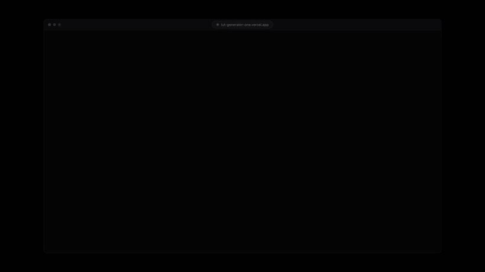
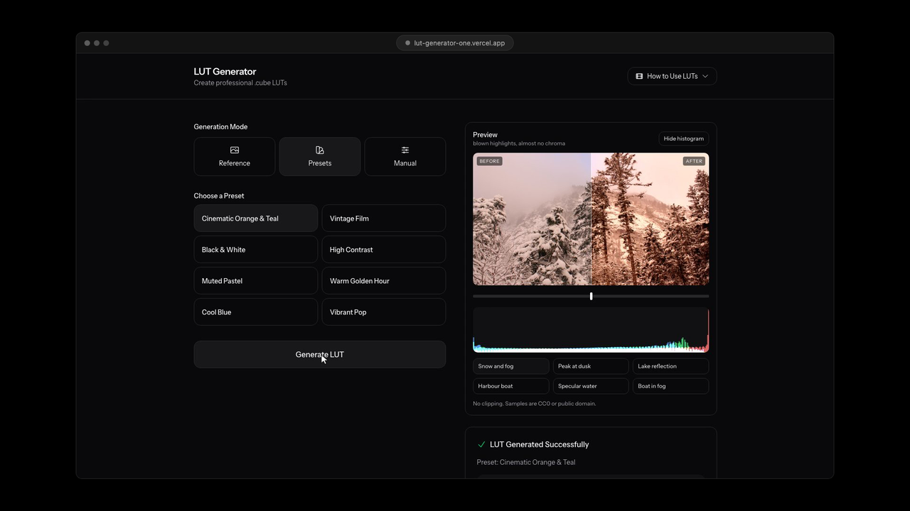

# LUT Generator

Create professional .cube LUT files from reference images, presets, or manual controls. The app outputs industry-standard 3D LUTs compatible with Final Cut Pro, Premiere Pro, DaVinci Resolve, After Effects, and other editors.

**Nothing leaves your machine.** There is no API, no account and no key. The
grading maths runs in the browser, in `src/lib`, so the image you point it at is
never uploaded and the 947 KB .cube file it writes is built client side. The
fonts are self hosted through `next/font`, so opening the page makes no request
to any third party at all.

## Features

- Image reference analysis to extract grading parameters
- Eight presets: Cinematic Orange & Teal, Vintage Film, Black & White, High Contrast, Muted Pastel, Warm Golden Hour, Cool Blue, Vibrant Pop
- Manual controls for contrast, saturation, temperature, tint, shadows, highlights, and RGB lift/gamma/gain
- Live preview on six real photographs, with a before and after split you can drag
- RGB histogram, and a clipping warning that counts the pixels actually pinned at 0 and 255
- .cube output with standard 33x33x33 grid

## Supported Software

- Final Cut Pro
- Adobe Premiere Pro
- DaVinci Resolve
- After Effects
- Avid Media Composer
- LumaFusion
- Any editor that supports .cube LUT files

## Tech Stack

- Next.js 16 and React 19
- Tailwind CSS 4
- TypeScript

No runtime dependencies beyond those. The colour transforms, the .cube writer
and the reference-image analysis are all in `src/lib`, in 630 lines.

## Getting Started

1. Install dependencies:
   `npm install`
2. Run the development server:
   `npm run dev`
3. Open `http://localhost:3000`

## Build For Production

1. Build:
   `npm run build`
2. Start:
   `npm start`

## How To Use The App

1. Choose a generation mode: Reference, Presets, or Manual.
2. Provide your input (image, preset, or manual values).
3. Click `Generate LUT`.
4. Download the `.cube` file or copy it to clipboard.

Every generated file names what it was made from, so a folder of them stays
readable a month later:

### The preview is the point

A LUT is 947 KB of numbers. You cannot read it, so the only way to know what it
does is to look at it on a picture, which is what the preview is for. It applies
the grade in the browser with trilinear interpolation on a 17 point grid, and
draws the ungraded original over the left of the same frame so the comparison is
the same pixels at the same scale rather than two different renders.

The six samples are mountains and boats, which is what camera makers shoot
their own sensor tests on: snow, water, sky and paint between them cover blown
highlights, specular clipping already at the limit before you touch it, a wide
neutral range, a saturated primary, and a near monochrome fog where a contrast
push has nothing to grab. Every one is CC0 or public domain, checked against the
file's own licence metadata rather than a site's blanket claim, so they can ship
in the repository. `public/samples/CREDITS.md` credits each one.

The camera makers' own sample clips would have been the obvious choice and
cannot be used: they are licensed for use inside your own productions and
explicitly not for redistribution as standalone assets, which is exactly what
committing them here would be.

The clipping line counts pixels sitting exactly at 0 and at 255 rather than
estimating from the histogram edges, because a bin at the end of a 256 bin
histogram also holds everything merely close to the end, and "nearly clipped" is
recoverable where clipped is not.

### There was an Apple HEVC output mode, and it was wrong

It claimed to compensate for HEVC's limited range and for a gamma closer to 1.96
than 2.2. Measured against the shipped code, with every grading parameter at
zero, it mapped 0 to 0.0627 and 1 to 0.9216 and left every value in between
bit identical. So the gamma compensation cancelled itself out exactly, and all
the mode really did was squeeze full range into limited range: applied in a host
that feeds full range values, it lifted blacks and dulled whites, which is the
artifact it claimed to prevent.

There is no correct version of it inside a .cube file. A LUT is defined on
0.0 to 1.0 and range handling belongs to the editor, not to the lookup table, so
the mode was removed rather than patched.

## How To Use .cube LUTs

### Final Cut Pro

1. Open Effects Browser
2. Search for "Custom LUT"
3. Drag effect to your clip
4. In Inspector, click LUT dropdown
5. Choose "Choose Custom LUT"
6. Select your `.cube` file

### Premiere Pro

1. Select your clip
2. Open Lumetri Color panel
3. Go to Creative tab
4. Click "Look" dropdown
5. Select "Browse"
6. Choose your `.cube` file
7. Adjust Intensity as needed

### DaVinci Resolve

1. Go to Project Settings
2. Select Color Management
3. Click "Open LUT Folder"
4. Copy `.cube` file there
5. Click "Update Lists"
6. In Color tab, right-click node
7. Choose LUTs → 3D LUT

### After Effects

1. Select your layer
2. Effect → Color Correction
3. Apply "Lumetri Color"
4. In Creative section
5. Click "Look" dropdown
6. Browse to `.cube` file

## .cube File Format

The generated LUTs follow the Adobe Cube LUT specification:

- 33x33x33 3D lookup table (35,937 color points)
- RGB values from 0.0 to 1.0
- Red-major ordering (R varies fastest)

## Contributing

Keep changes small and focused. Please run `npm run build` before opening a PR.

## Code Of Conduct

Be respectful, constructive, and professional. Harassment and discrimination are not tolerated.

## Security

If you discover a security issue, open a GitHub issue and clearly mark it as security-sensitive so it can be triaged quickly.

## Trademarks

Final Cut Pro is a trademark of Apple Inc. Premiere Pro and After Effects are
trademarks of Adobe Inc. DaVinci Resolve is a trademark of Blackmagic Design.
Avid Media Composer is a trademark of Avid Technology. LumaFusion is a trademark
of LumaTouch.

They are named here only to say what this tool's output is compatible with. No
affiliation or endorsement is claimed, and none of their logos or product icons
appear anywhere in this repository: Adobe's trademark guidelines do not permit a
third party to use Adobe product icons without a written licence, and Apple and
Blackmagic take the same position. Word marks used descriptively are a different
thing from logos, which is why this lists names and not pictures.

## License

MIT. See `LICENSE`.
